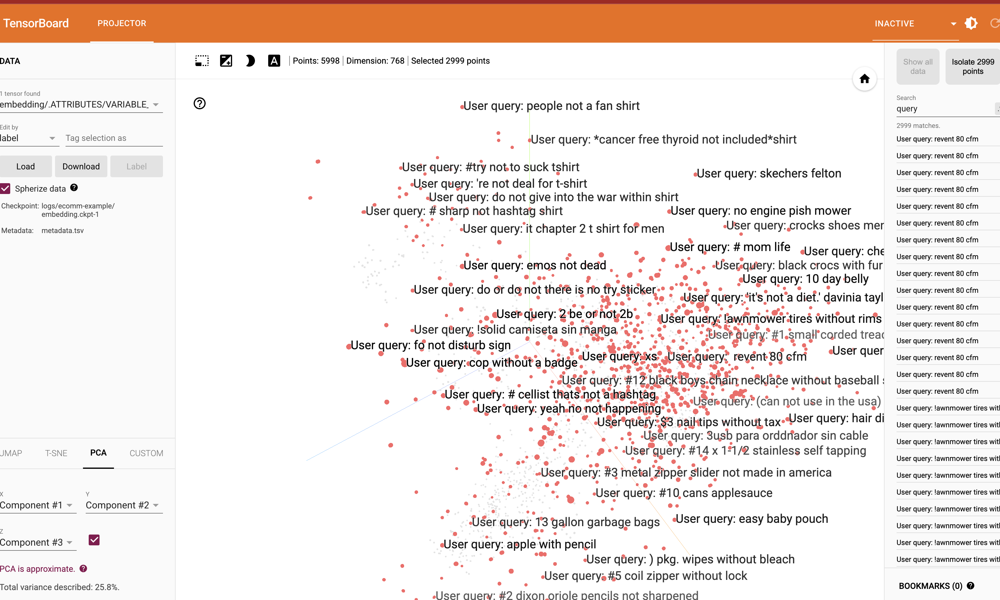

# Product search embedding exploration with Tensorboard

This repo covers how to:

1. Download data from hugging face ecommerce dataset (Clone data from https://github.com/amazon-science/esci-data)
2. Run batch prediction job to `textgecko`
3. Visualize the embedding using Tensorboard

## Getting started

1. Log in with ADC creditentials
2. Open [notebook]('notebooks/ecomm_gecko_tensorboard.ipynb')
## Results

The following image shows the embedding of the first 1000 products in the dataset. The embedding is a 768-dimensional vector, and each product is represented by a point in this space. The points are colored by the product category.

[](https://colab.research.google.com/github/

